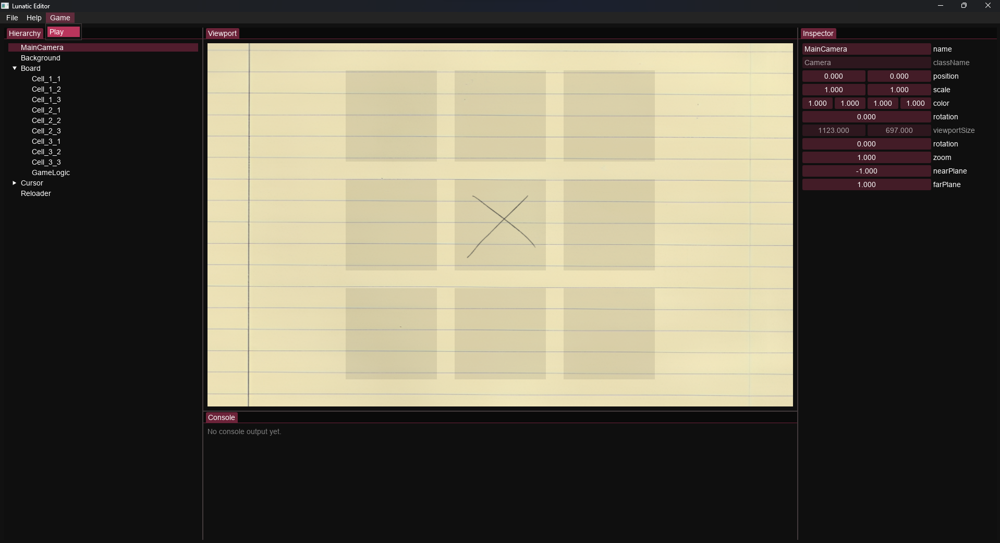

# Lunatic Engine

Modern 2D engine and editor focused on fast iteration - OpenGL 4.6, ImGui docking, LuaJIT scripting, and RTTR‑based scenes.

## TL;DR

- Open `LunaticEngine.sln` in Visual Studio 2022 (x64) and build. vcpkg manifest pulls deps automatically.
- Run `LunaticEditor` (viewport, Hierarchy, Inspector) or `LunaticRuntime` (loads `LunaticRuntime/scene.json`).

> [!NOTE]
> Cross-platform: the engine code is portable (GLFW/GLAD/ImGui/GLM/LuaJIT/RTTR). The provided solution targets Windows/Visual Studio today; Linux/macOS builds require generating project files (e.g., CMake) and integrating vcpkg. A first‑class cross‑platform build method (e.g., CMake presets) will be added in a future update.

> [!IMPORTANT]
> vcpkg is required and must be integrated with MSBuild for dependencies to resolve.
> - Install vcpkg: https://learn.microsoft.com/vcpkg/get_started/overview
> - MSBuild integration (Visual Studio): https://learn.microsoft.com/vcpkg/get_started/get-started-msbuild
> - Manifests (how deps are declared): https://learn.microsoft.com/vcpkg/users/manifests

## TODO

- [x] Scene graph
- [x] Basic renderer
- [x] Lua coroutines
- [x] Reflection based API
- [x] JSON serialization/deserialization
- [x] Audio support
- [x] Physics integration
- [ ] `std::vector` usage reviewed (where can be `std::span`?)
- [ ] Reflection codegen

## Features

- 2D rendering (Camera, Sprite, Texture, Framebuffer) with an embedded default shader.
- Scene graph with reflection: `Instance`, `Renderable`, `Updateable` (auto-registered with the Engine).
- JSON save/load driven by RTTR properties; `construct(name)` factory for typed deserialization.
- Lua scripting via coroutines; access Engine, scene, and reflected properties/methods from Lua.

## Layout

- `LunaticEngine/` core library: `core/`, `model/` (incl. `primitives/`), `render/`, `vendor/stb.cpp`.
- `LunaticEditor/` app (ImGui dockspace, viewport/HUD, save & play/stop).
- `LunaticRuntime/` app, assets, and `scene.json`.

## How it works (short)

- Instance tree: `Sprite`, `Camera`, `Script`, `NativeScript` extend `Instance` (+ mixins).
- Renderer uses a single main `Camera` (registered on construction). Sprites share GL buffers.
- Editor renders to a `Framebuffer` shown as an ImGui image; property UI is RTTR-driven.
- Scripting: Lua gets `engine`, `root`, `script`, plus `vec2/vec4`; call into reflected props/methods; `yield()` to step frames.

## License

No license at this time. All rights reserved. Do not use, redistribute, or modify without prior written permission.